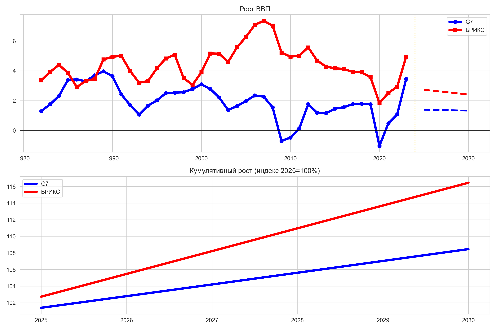
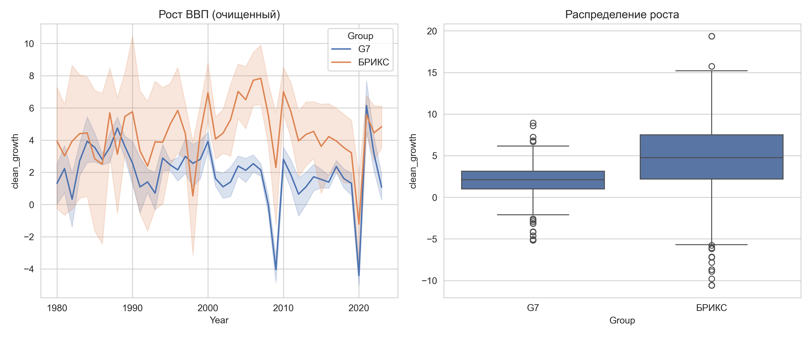

# brics-g7-gdp-forecast
G7 vs БРИКС: Прогноз роста ВВП 2025-2030
**Модель ML улучшила прогноз в 2+ раза** 

БРИКС обгоняет G7 на 1.21% ежегодно.

## РЕЗУЛЬТАТЫ

| Метрика | G7       | БРИКС    | Улучшение |
|---------|----------|----------|-----------|
| **MAE** | 1.29% ↓  | 2.93% ↓  | **в 2x**  |
| **R²**  | 0.296 ↑  | -0.036 ↑ | +         |
| **Прогноз** | 1.36% | **2.57%** | **+1.21%** |

Почему BRICS R²=-0.036?

**BRICS = 10 очень разных экономик:**
- **Индия +6.7%** vs **ЮАР +0.6%** vs **Эфиопия -6%**
- Волатильность ×2 выше G7

**НО MAE 2.93%**
Гипотеза подтверждена: **БРИКС +2.57% > G7 +1.36%**

## ВИЗУАЛИЗАЦИЯ

## ТЕХНОЛОГИЯ

    Данные: World Bank GDP Growth 1980-2030 (Kaggle)
    Модели: RandomForest + LinearRegression (blend 60/40)
    Признаки: lag1, lag2, trend, volatility, clean_growth (без выбросов)
    Валидация: TimeSeriesSplit (5 фолдов)

## ПОЛНЫЙ АНАЛИЗ

    1️⃣ Подготовка данных + очистка выбросов
    2️⃣ Базовые метрики (CAGR)
    3️⃣ Исторические тренды (графики)
    4️⃣ Обучение RF + LR моделей
    5️⃣ Прогноз 2025-2030
    6️⃣ Сводная таблица
    7️⃣ Финальные графики
    8️⃣ Валидация (MAE/R²)

## ПРОГНОЗ

    2025-2030: G7 1.36% | БРИКС 2.57% | Разница +1.21%
    Кумулятивно: БРИКС обгонит G7 к 2030!

## УСТАНОВКА

pip install pandas scikit-learn matplotlib seaborn numpy

Загрузка данных

df = pd.read_csv('real-gdp-growth.csv')
Запуск блокнота → результат!

## 📚 ДАННЫЕ
[World Bank GDP Growth 1980-2030](https://www.kaggle.com/datasets/sndorburian/annual-gdp-growth-1980-to-2030)
